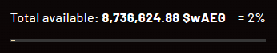

# Aether Games: $AEG

Aether Games is a [studio](https://aethergames.io/) which is currently working on two games:

- Cards of Ethernity (TGC)
  - [Gameplay](https://www.youtube.com/watch?v=X4-tZbOszoY&ab_channel=TheaBeasty)
- Gates of Ethernity (Auto battler)
  - [Trailer](https://x.com/SupraOracles/status/1550159172943040512?s=20)

They have an ongoing presale for their token $AEG, which is used across the Aether ecosystem.

**NOTE**: most info is derived from a [pitchdeck](https://x.com/KD_SINGH86/status/1658373637928542208?s=20) posted on X. Their UI/Docs have very little detail about the sale

## Utility

AEG will have most of your value accrual staples:

- Can't play to earn without staking for 90 days
- Can't farm without gaming
- Stake to receive asset/card airdrops
- Used as currency across games
- Burn tokens for crafting system resources

## Stats

Presale:

- Ongoing since [September](https://medium.com/@AetherGames/asset-tokenization-waeg-aeg-presale-launch-and-airdrop-for-genesis-holders-today-cfcb3a52b539)
- ~$1m circulating
- $45m fully diluted
- 2.5% of supply being sold. 10% unlock at TGE
- 1 NFT = 1 $200 allocation. Can stack
- 30% of sale available at time of writing (8.7m / 25m). You can't see this without owning an NFT.
  

NFTs:

- 1144/3000 [Genesis NFTs](https://aethergames.io/mint) minted at time of writing. 130 day old contract.
- [Founders pack](https://aethergames.io/mint) comes with an assortment of cards/assets and "holders benefits" for allo, whitelists, freemints etc

_**IMPORTANT**: You can buy an NFT and keep sending it to new addresses purchase the presale with larger size. You can also WETH it afterwards no problem._

Analog:

- Illuvium
  - Mcap: $700m
  - FDV: $1.1

## Attention (narrative)

This project is quite lowkey. The last time I could find the presale being mentioned on X was in September and the most informative thread I found on it has 2 likes. They have 60k followers but I only have 2 mutuals who are following. I imagine they purchase social stats as many NFT projects tend to do.

Most attention has from [investors](https://x.com/KD_SINGH86/status/1658373637928542208?s=20). Notably:

- Magic Eden
- Illuvium
- Polygon Ventures
- GSR Ventures

Illuvium has already [collaborated](https://aethergames.io/ilv-packs) on a cards of Ethernity card deck.

## Impressions

I'm not a tgc guy, so I take everything with a grain of salt. But $275 to get into an allocation with $1m valuation at TDE and one of the closest things you can compare it to has a fdv which is 20x the size. It seems like a decent quality asymmetric bet.

I dislike that it is on Polygon, but I also dislike that Illuvium is on Immutable X.
